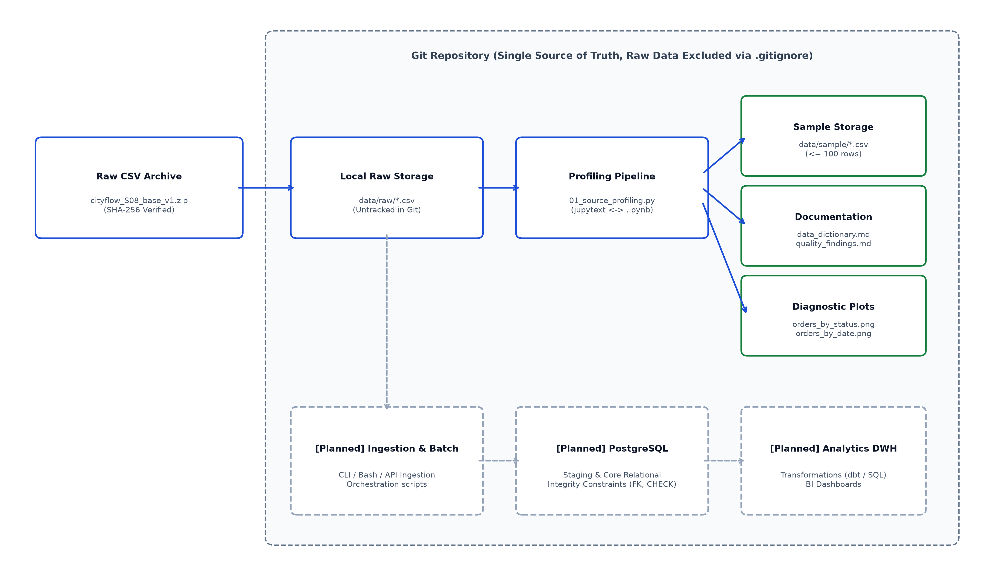

# CityFlow Data Engineering Project (S08)

## 1. Загальний опис проєкту
Проєкт присвячений побудові платформи обробки даних для сервісу доставки **CityFlow**. Платформа акумулює інформацію про клієнтів, партнерські заклади (мерчанти), номенклатуру товарів і транзакції замовлень.

- **Студент:** Tim
- **Варіант набору даних:** CityFlow S08 (`cityflow_S08_base_v1.zip`)
- **Робоче середовище:** Arch Linux, Neovim, uv, Python 3.12+

---

## 2. Архітектура та рух даних


Рух даних на етапі Лабораторної роботи №1:
1. Сирі CSV-файли верифікуються за SHA-256 та імпортуються до каталогу `data/raw/` (виключені з контролю версій Git).
2. Пайплайн профілювання (`notebooks/01_source_profiling.py` <-> `.ipynb`) виконує структурний, статистичний та реляційний аудит джерел.
3. Артефакти фіксуються у вигляді семплів даних (`data/sample/`), діагностичних графіків (`docs/*.png`) та аналітичної документації (`docs/*.md`).
4. Компоненти реляційного завантаження (PostgreSQL) та аналітичного сховища заплановані для реалізації на наступних етапах[cite: 4].

---

## 3. Структура проєкту
```text
├── data/
│   ├── raw/                 # Незмінні первинні CSV (ігноруються в Git)
│   └── sample/              # Семпли даних (100 рядків) для відтворюваності
├── docs/
│   ├── architecture_v0.png  # Архітектурна діаграма системи
│   ├── data_dictionary.md   # Повний словник атрибутів джерел
│   ├── data_quality_findings.md # Реєстр виявлених проблем якості
│   └── orders_by_*.png      # Діагностичні графіки розподілу замовлень
├── notebooks/
│   ├── 01_source_profiling.py     # Джерельний Python-код із розміткою percent
│   └── 01_source_profiling.ipynb  # Скомпільований блокнот з розрахунками
├── scripts/
│   └── build_docs.py        # Утиліта генерації документації та схем
├── pyproject.toml           # Маніфест залежностей uv
├── uv.lock                  # Зафіксовані точні версії середовища
└── README.md
